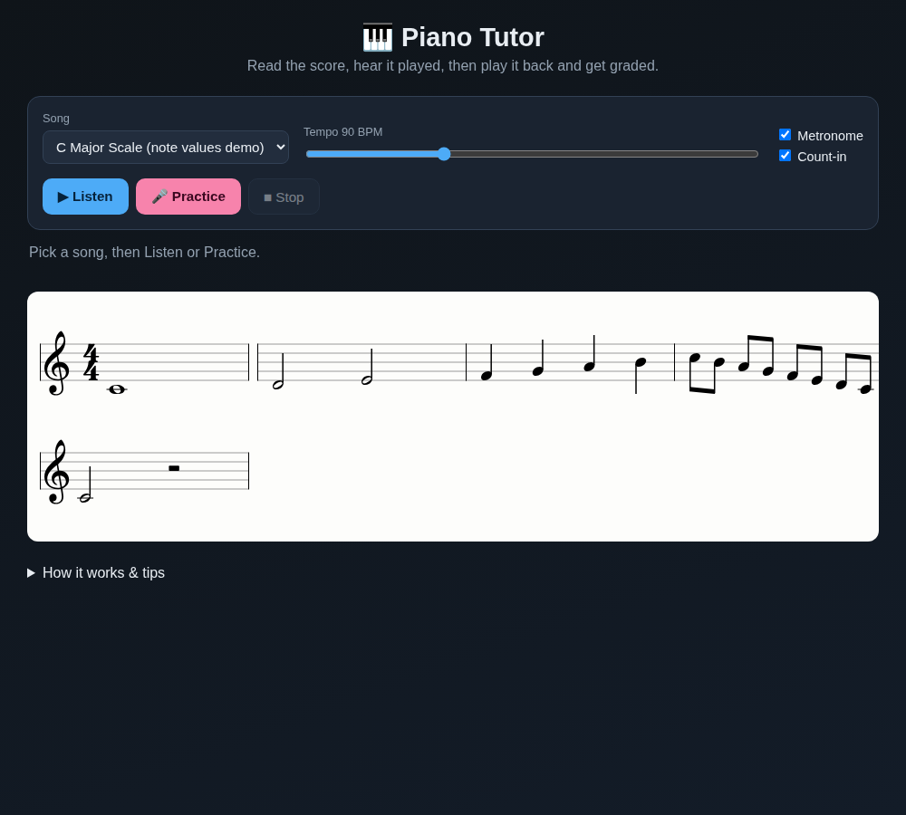

# 🎹 Piano Tutor

A browser-based app for learning to read and play piano. It engraves real sheet
music, plays the piece for you with a synthesized piano and metronome,
highlights each note in time with the beat, then listens to you play through the
microphone and grades how accurately you played.

No build step, no backend — it's plain HTML/CSS/JavaScript with VexFlow vendored
locally, so it runs fully offline.



## Features

- **Sheet music rendering** — proper engraving via [VexFlow](https://www.vexflow.com/):
  treble clef, key/time signatures, whole, half, quarter, eighth and sixteenth
  notes, dotted notes, rests, accidentals, beaming and multi-line wrapping.
- **Listen mode** — hear the piece played by a synthesized piano (Web Audio),
  with each note highlighted on the staff exactly in time with the tempo.
- **Metronome** — accented downbeats, sample-accurate scheduling against the
  audio clock, with an optional one-bar count-in.
- **Tempo control** — 40–208 BPM. Note highlighting, audio and metronome all
  follow the BPM, so you can slow tricky passages down.
- **Practice mode** — a one-bar count-in, then the app listens to you play via
  the microphone, detects pitch in real time (autocorrelation), and grades each
  note. Correct notes turn green, wrong notes red, missed notes grey, and you
  get an overall accuracy score and star rating.

## Running it

Pitch detection needs microphone access, which browsers only allow on
`localhost` or HTTPS. Serve the folder over HTTP:

```bash
cd piano-app
python3 -m http.server 8000
# then open http://localhost:8000
```

(Opening `index.html` directly via `file://` works for **Listen** mode, but
**Practice** mode needs the `localhost`/HTTPS origin for the microphone.)

1. Pick a song and set the tempo.
2. Click **▶ Listen** to hear and watch it played.
3. Click **🎤 Practice**, allow the microphone, wait for the one-bar count-in,
   then play along. Your score appears when the piece ends.

## Project layout

```
piano-app/
├── index.html          # markup + script load order
├── css/styles.css      # styling
├── vendor/vexflow.js   # VexFlow 4.2.2 (vendored, UMD global `Vex`)
└── js/
    ├── music.js        # pitch/MIDI/frequency + note-duration math
    ├── songs.js        # built-in pieces
    ├── notation.js     # VexFlow rendering, measure layout, highlighting
    ├── audio.js        # piano synth + metronome scheduling
    ├── pitch.js        # microphone autocorrelation pitch detector
    ├── scorer.js       # aligns detected pitch to the score and grades it
    └── app.js          # UI controller / transport / state machine
```

## How grading works

Each note in the score occupies a time window derived from its duration and the
tempo. While you play, `pitch.js` reports the fundamental frequency several times
per window; `scorer.js` takes the dominant detected pitch in each window and
compares it to the expected note (within a half-step tolerance). Accuracy is the
fraction of notes played at the right pitch.

## Adding songs

Append an entry to `js/songs.js`. Durations use VexFlow codes
(`w` whole, `h` half, `q` quarter, `8` eighth, `16` sixteenth; add `d` for a dot,
`r` for a rest). For example:

```js
{ keys: ['e/4'], duration: 'qd' }  // dotted quarter, E4
{ keys: ['c/4'], duration: '8r' }  // eighth rest
```

## Tech notes

- All audio scheduling is done against the `AudioContext` clock for tight
  timing; the `requestAnimationFrame` loop only drives the visual highlight and
  records microphone samples.
- VexFlow is vendored rather than loaded from a CDN so the app works offline and
  has no third-party runtime dependency.
